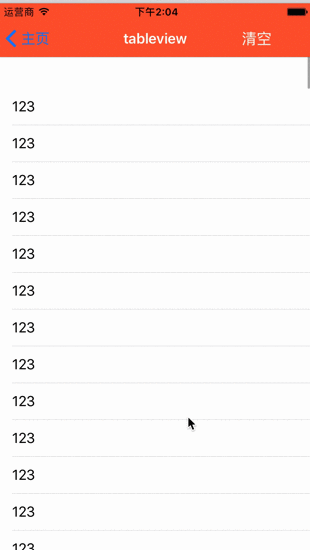
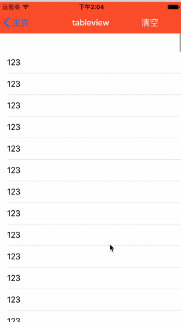

# 一句代码给UITableview，UICollectionView 添加占位图

### 使用方法

##### TableView

```
引入头文件
#import "UITableView+PlaceHolderView.h"

//只需打开这个属性
self.tableView.enablePlaceHolderView = YES;
```
##### 效果图


##### CollectionView
```
引入头文件
#import "UICollectionView+PlaceHolderView.h"

//只需打开这个属性
self.CollectionView.enablePlaceHolderView = YES;
```
##### 效果图


### 如果需要自定义占位图样式
```
/**
 自定义站位图只需赋值给这个view,如无需自定义忽略此属性
 */
@property (nonatomic, strong) UIView *yh_PlaceHolderView;

比如：
self.tableView.yh_PlaceHolderView = ?(你自定义的View)


```


### 安装
#### Cocoapods
1.在 Podfile 中添加 ```pod "YHPlaceHolderView" ```   
2.执行 ```pod install``` 或 ```pod update```
#### 手动安装
1.下载demo将PlaceHolderView文件夹添加到你的工程